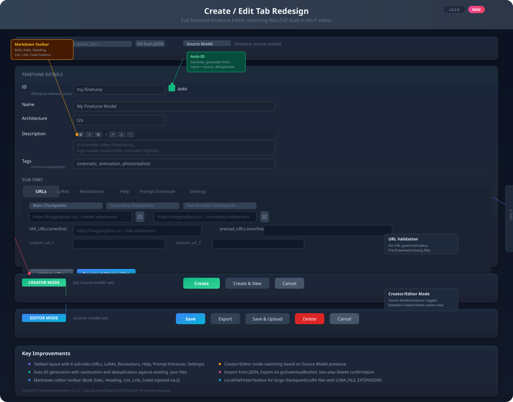

# Wan2GP Finetune Manager Plugin v3.2.0

Community finetune registry plugin for Wan2GP. Browse, load, create, improve, and upload finetune JSONs with an integrated Create/Edit tab that matches the built-in Finetune Editor (Alt+F).

## Features

| Tab | Functionality |
|---|---|
| **Browse** | Refresh registry, search/architecture/tag filter, per-URL validation, download, improve/create variant |
| **Create / Edit** | Full tabbed form matching FINETUNES.md spec, Auto-ID, Markdown toolbar, Creator/Editor mode, Import/Export, URL validation, pre-download, two-step delete |
| **Local** | Visual card browser, load & switch, delete, export via DownloadButton, import .json, upload to registry, file management |
| **Upload** | Pick a local finetune from dropdown, preview its JSON, push to HF community registry |
| **CivitAI** | Search CivitAI by query/type/base model, browse results with version details, one-click URL fill into editor |

## Install

### Easiest — Install from URL (in Wan2GP)
1. Open Wan2GP → **Plugins** tab
2. Click **Install from URL** (expand the section)
3. Paste the GitHub URL into the **GitHub URL** field:

   ```
   https://github.com/GKartist75/Wan2GP-finetune-manager
   ```

4. Click **Download and Install from URL**
5. Restart Wan2GP when prompted

### Alternative — Manual
1. Download or clone the repo into `C:\Users\gjaku\Wan2GP\plugins\wan2gp-finetune-manager`
2. Restart Wan2GP

## Upload to Registry

The plugin ships with a registry token. Anyone can upload finetune JSONs to the community registry at `GKartist75/wan2gp-finetunes`. No account or collaborator setup needed.

## Files

```
wan2gp-finetune-manager/
├── __init__.py
├── config.json           # Registry write token (renew at huggingface.co/settings/tokens)
├── plugin.py             # All plugin logic (1800+ lines)
├── plugin_info.json      # Plugin metadata v3.2.0
├── test_plugin.py        # 152 unit tests
├── CHANGELOG.md          # Version history
└── sync.ps1              # Dev deployment script (not needed for users)
```

## 📸 Showcase: Create/Edit Tab Redesign



### Redesign Highlights
- **Tabbed Layout** — 6 sub-tabs: URLs, LoRAs, Resolutions, Help, Prompt Enhancer, Settings
- **Auto-ID** — Sanitizes input, generates ID from source model + finetune name, deduplicates
- **Markdown Toolbar** — Bold, Italic, Heading, List, Link, Code buttons in description fields
- **Creator/Editor Mode** — Source Model presence toggles between creator (Create/Create & New/Cancel) and editor (Save/Export/Save & Upload/Delete/Cancel) action rows
- **URL Validation** — Per-URL green/red status with HEAD+GET+RANGE fallback; pre-download missing files
- **Import/Export** — Import from JSON, Export via DownloadButton, two-step Delete confirmation

## 🔗 Links

- **GitHub**: https://github.com/GKartist75/Wan2GP-finetune-manager
- **HF Registry**: https://huggingface.co/spaces/GKartist75/wan2gp-finetunes — browse the finetune registry live with search/filter and click-to-expand JSON details
