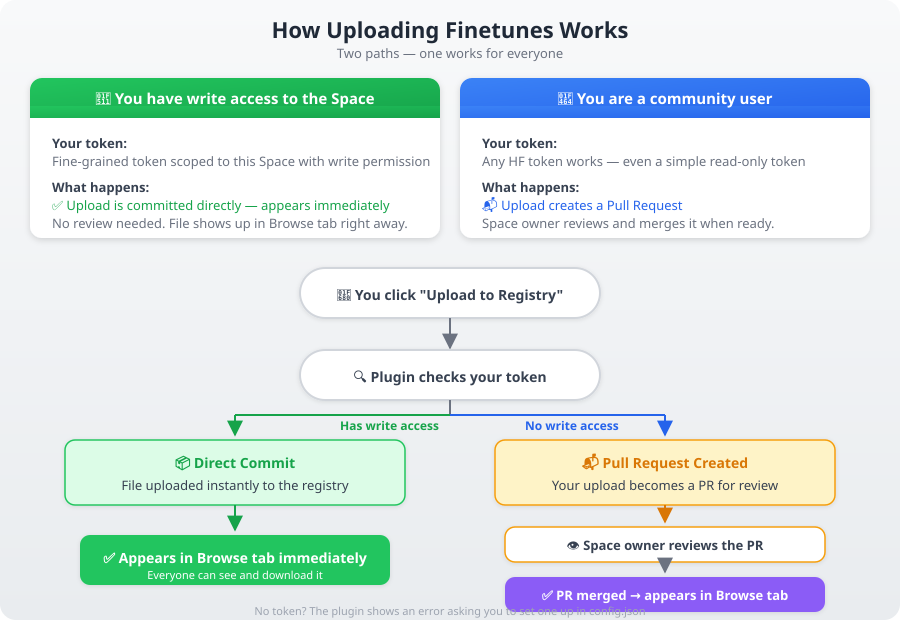

# Wan2GP Finetune Manager Plugin v3.6.1 🧪

> ⚠️ **This is a test version!** The plugin is still in active development. If you find bugs, have suggestions, or run into any issues, please let me know:
> - **GitHub Issues**: [Open an issue](https://github.com/GKartist75/Wan2GP-finetune-manager/issues)
> - **Wan2GP Discord**: [Post in the Plugins Catalog — Wan2GP Finetune Manager](https://discord.com/channels/1361676211817939125/1527049874699325490)

Community finetune registry plugin for Wan2GP. Browse, load, create, improve, and upload finetune JSONs with an integrated Create/Edit tab that matches the built-in Finetune Editor (Alt+F).

> **Latest version: v3.6.1** — [GitHub](https://github.com/GKartist75/Wan2GP-finetune-manager) | [HF Registry](https://huggingface.co/spaces/GKartist75/wan2gp-finetunes) | [User Guide](./user-guide.html)

## Features

| Tab | Functionality |
|---|---|
| **Browse** | Refresh registry, search by name/description/author/ID, filter by architecture or tag, click cards for JSON details, validate URLs, download locally, improve/create variant |
| **Create / Edit** | Full tabbed form (URLs, LoRAs, Resolutions, Help, Prompt Enhancer, Settings) with Auto-ID, Markdown toolbar, Creator/Editor mode, Import/Export, URL validation, pre-download, two-step delete. All URL/LoRA fields include a **Browse 📂** button for native file selection. |
| **Local** | Visual card browser, load & switch, delete, export, import .json with preview, upload to registry |
| **CivitAI** | Search CivitAI by query/type/base model, browse results with version details, one-click URL fill (routes to LoRA or main checkpoint automatically) |

## Install

### Easiest — Install from URL (in Wan2GP)
1. Open Wan2GP → **Plugins** tab
2. Click **Install from URL** (expand the section)
3. Paste the GitHub URL into the **GitHub URL** field:

   ```
   https://github.com/GKartist75/Wan2GP-finetune-manager
   ```

4. Click **Download and Install from URL**
5. Restart Wan2GP when prompted

### Alternative — Manual
Clone or download into `plugins/finetune_manager`, then restart Wan2GP.

## Registry Token Setup

A token is only needed to **upload** finetunes — browsing, searching, and downloading from the registry work without one.

### Quick Start (1 minute)

1. Get a **User Access Token (read)** at [huggingface.co/settings/tokens](https://huggingface.co/settings/tokens)
   - Click **New token** → **read** → give it a name → **Create token**
   - A read-only classic token is all you need — you don't need write access

2. Create `config.json` in the plugin folder (`plugins/Wan2GP-finetune-manager/config.json`):

   ```json
   {"registry_token": "hf_YOUR_TOKEN_HERE"}
   ```

   Replace `hf_YOUR_TOKEN_HERE` with your actual token. See [`config.example.json`](./config.example.json).

3. Done! The plugin picks it up automatically after restart.

**Alternative:** Run `huggingface-cli login` in your terminal instead.

> ⚠️ `config.json` is gitignored — your token stays local and will never be committed.
> 💡 No token? Skip steps 1-3. You can still use Browse, Create/Edit, Local, and CivitAI tabs. Upload will show a clear error asking you to set up your token.

### How It Works



The plugin automatically detects your access level:

| **User Access Token (read)** | Pull Request created at [discussions](https://huggingface.co/spaces/GKartist75/wan2gp-finetunes/discussions) | 📬 Owner reviews and merges |
| **No token** | Upload blocked with help message | ❌ Follow Quick Start to set one up |

**What happens when you upload:**
1. The plugin uses your token to submit the finetune
2. Since you don't have write access, it automatically creates a **Pull Request**
3. You'll see a confirmation with a link to the PR
4. The Space owner reviews your submission and merges it
5. Once merged, your finetune appears in everyone's Browse tab

## Files

```
wan2gp-finetune-manager/
├── __init__.py
├── config.example.json  # Registry token template (copy to config.json)
├── config.json          # Registry token (gitignored — create from config.example.json)
├── plugin.py            # All plugin logic (4 tabs)
├── plugin_info.json     # Plugin metadata v3.6.1
├── CHANGELOG.md         # Version history
├── user-guide.html      # Friendly walkthrough of all features
└── .gitignore
```

## What's New in v3.6.1

- **LoRAs now load correctly from finetunes** — `model.loras` is promoted to top-level `activated_loras` when writing the Wan2GP settings file, so `load_settings_from_file` finds and applies them. The Gradio UI is also force-refreshed to populate the LoRA tab after switching.
- **preload_URLs accepts bare model names** — built-in model identifiers like `ltx2_22B_distilled` no longer trigger a false "needs full https:// URL" validation error.
- **Registry finetunes updated** — `EasyWan22_FastMix` now has top-level `activated_loras` in the HF Space registry.

## What's New in v3.5.1

- **Community uploads via PR** — users without write access to the registry Space can now upload. The plugin auto-detects permission issues and creates a Pull Request instead of failing. [Community Tab](https://huggingface.co/spaces/GKartist75/wan2gp-finetunes/discussions)
- **Security** — `config.json` is now gitignored. Tokens stay local, never in git.
- **Config template** — `config.example.json` added as a safe template.

## What's New in v3.5.0

- **User guide** — new `user-guide.html` with a friendly, visual walkthrough of all features and common workflows
- **Bug fixes** — textbox fields no longer get cleared when changing dropdown selections; `finetune_source_model` no longer gets overwritten on improve
- **Import preview** — selecting a .json file for import now shows its contents before you commit
- **Registry cache** — 30-second TTL cache prevents redundant fetches on rapid Refresh clicks
- **Dark mode** — card HTML uses CSS custom properties instead of hardcoded colors, adapting to Wan2GP's theme
- **Round-trip stability** — key ordering preserved when editing and re-uploading finetunes
- **Code deduplication** — shared URL/LoRA key lists and card HTML builder extracted to module-level, removing ~150 lines of duplicated code

## 🔗 Links

- **GitHub**: https://github.com/GKartist75/Wan2GP-finetune-manager
- **HF Registry**: https://huggingface.co/spaces/GKartist75/wan2gp-finetunes — browse the finetune registry live with search/filter and click-to-expand JSON details
- **User Guide**: [user-guide.html](./user-guide.html) — visual walkthrough of all features
